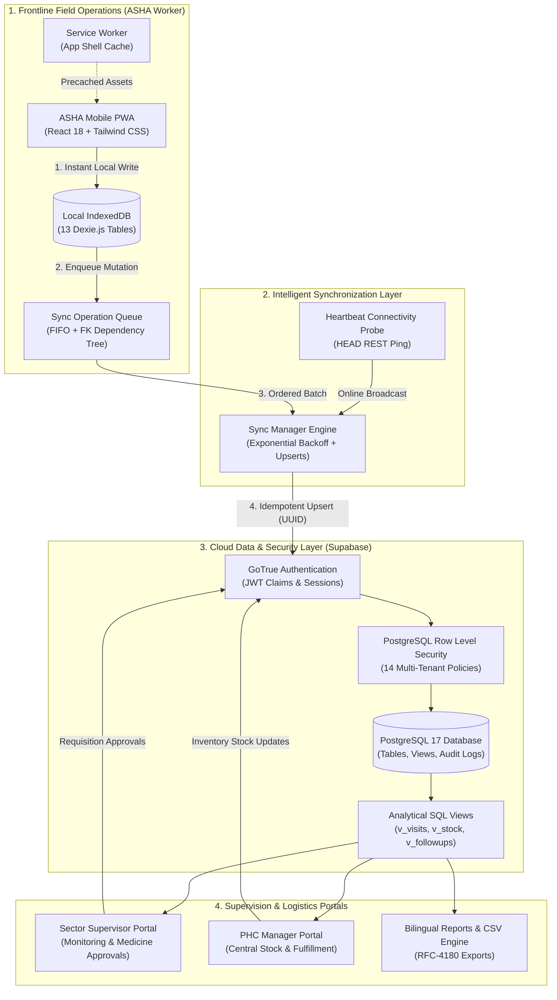

# ASHA Saathi (आशा साथी) — Complete System Architecture

> **Architecture Specification & Component Design**  
> **Target Release**: v1.0.0-hackathon (RC-1 Verified)

---

## 1. High-Level Architecture Overview

ASHA Saathi is built on an **offline-first Progressive Web Application (PWA)** architecture. The system guarantees full field operability under zero cellular connectivity, while providing seamless cloud synchronization to sector supervisors and PHC facility managers.



---

## 2. Architectural Pillars

### Pillar 1: Offline-First Local Data Layer
- **Client Storage**: All entity mutations (`households`, `patients`, `visits`, `follow_ups`, `referrals`, `medicines`, `medicine_orders`, `pregnancies`, `tasks`, `notifications`) write synchronously to local IndexedDB stores via Dexie.js.
- **Latency**: User actions complete with sub-50ms UI response times regardless of network quality.
- **Storage Quota**: IndexedDB stores tens of thousands of text records using less than 15MB of device memory.

### Pillar 2: Relational Background Synchronization Engine
- **Client-Side UUIDs**: Every record generated offline receives a UUID (`crypto.randomUUID()`) serving as both local primary key and server-side idempotency token.
- **Dependency Ordering**: Prevents foreign key constraint violations on the server:
  1. `households` (Family registry)
  2. `patients` (Individual family members)
  3. `pregnancies` (Maternal records)
  4. `visits`, `follow_ups`, `referrals` (Clinical encounters)
  5. `medicine_orders` (Supply requests)
- **Zero Duplicates**: PostgreSQL `ON CONFLICT (id) DO UPDATE` ensures re-attempted requests never create duplicate rows.

### Pillar 3: Multi-Tier Healthcare Access Control (RBAC & RLS)
- **Zero Trust Client**: The client application never assumes trust. All REST queries pass user JWTs directly to PostgreSQL.
- **Row Level Security (RLS)**: Enforced via PostgreSQL policies and helper function `get_current_role()`:
  - **ASHA Workers**: Scoped strictly to `assigned_asha_id = auth.uid()`.
  - **Supervisors**: Scoped to all ASHAs in their sector PHC.
  - **Managers**: Facility-wide administrative access to central pharmacy depots.

### Pillar 4: Shared Device Sanitization
- Frontline workers frequently share tablet computers at Sub-Centres and PHCs.
- Upon logout, `useAuth` executes an atomic `clearLocalDatabase()`, wiping all 13 IndexedDB stores and cached session tokens to prevent inter-worker health information leaks.

---

## 3. Complete Source Tree Layout

```
.
├── docs/                        # Architecture, deployment, runbooks, and QA reports
├── public/                      # App icons, manifest, and offline assets
├── src/
│   ├── components/
│   │   ├── common/              # Button, Input, Card, Badge, Alert, SyncStatusBar, OfflineBanner
│   │   ├── households/          # HouseholdCard
│   │   ├── navigation/          # BottomNav (Mobile 5-tab bar)
│   │   ├── patients/            # PatientCard (with data-testid)
│   │   └── reports/             # ReportFilters, ReportStatCard, StatusBarChart, VisitSparkline
│   ├── constants/               # Demo personas and credentials
│   ├── features/
│   │   ├── asha/                # AshaDashboard & AshaShell
│   │   ├── auth/                # LoginView (1-tap demo personas)
│   │   ├── followups/           # FollowUpsListView & FollowUpsSection
│   │   ├── households/          # HouseholdsListView, AddHouseholdView, HouseholdDetailsView
│   │   ├── manager/             # ManagerShell (Central PHC Admin)
│   │   ├── maternal/            # MaternalSection & ChildTrackingSection
│   │   ├── medicines/           # MedicineRequestView, SupervisorMedicineView, ManagerStockView
│   │   ├── notifications/       # NotificationsView
│   │   ├── patients/            # PatientsListView, AddPatientView, EditPatientView, PatientProfileView
│   │   ├── profile/             # AshaProfileView & Language Switcher
│   │   ├── referrals/           # AddReferralView & ReferralsSection
│   │   ├── reports/             # AshaReportView, SupervisorReportView, ManagerReportView
│   │   ├── supervisor/          # SupervisorShell
│   │   ├── tasks/               # TasksListView
│   │   └── visits/              # AddVisitView & VisitHistorySection
│   ├── hooks/                   # useAuth, useConnectivity, useLanguage, useSyncState
│   ├── layouts/                 # AppLayout (Header, SyncStatusBar, Page Container)
│   ├── lib/                     # Supabase client singleton
│   ├── locales/                 # Bilingual English/Hindi dictionary (translations.ts)
│   ├── services/                # dataService, offlineDatabase, syncManager, auditLogger, reportService
│   ├── types/                   # TypeScript database entities and enums
│   ├── utils/                   # csvExport, maternalChildUtils, validation (Zod)
│   ├── App.tsx                  # Root role-based shell router
│   └── main.tsx                 # React DOM mount point
├── supabase/
│   ├── migrations/              # 4 Ordered SQL migrations (Phase 1, 5, 7, 8)
│   └── seed/                    # Demo seed and transactional reset scripts
├── tests/                       # 7 Playwright E2E test suites (64 runs total)
└── vercel.json                  # Production edge routing, PWA cache headers, and security rules
```
