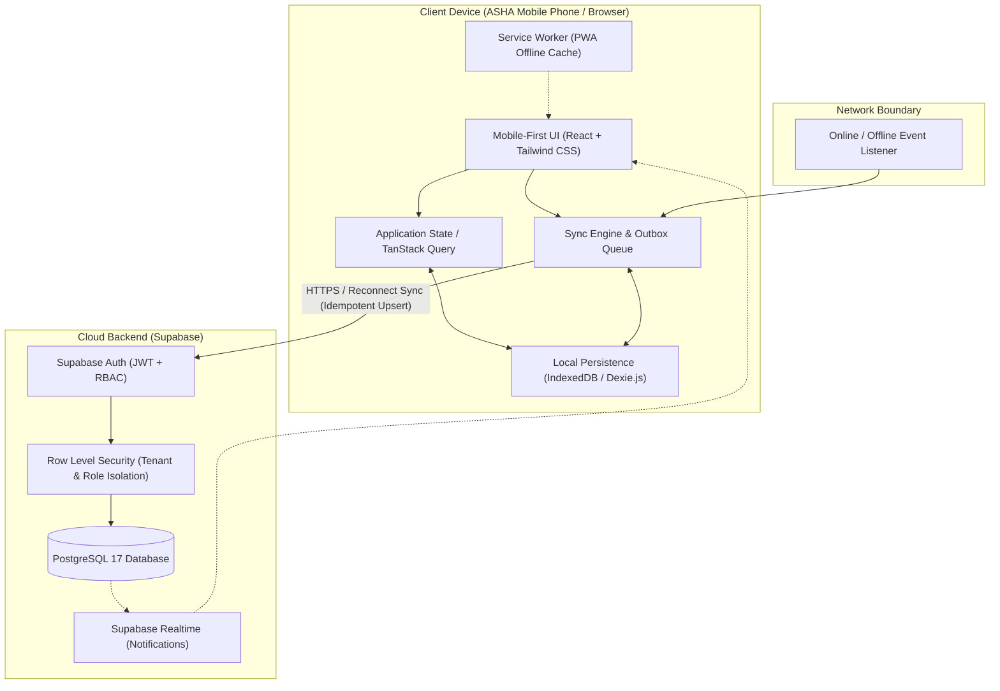

# ASHA Digital Platform — System Architecture

## 1. Executive Overview
The ASHA Digital Platform is an **offline-first Progressive Web Application (PWA)** engineered to replace manual registers for community health workers (ASHAs) across rural and semi-urban India. The system guarantees 100% operational continuity under zero-connectivity conditions while maintaining strict role-based access, auditability, and data integrity with a central cloud backend.

## 2. Architectural Layers

### A. Client Presentation Layer (Mobile-First)
- **Framework**: React 18+ with TypeScript and Vite.
- **Styling**: Tailwind CSS configured with a high-contrast healthcare palette (Accessible Emerald, Slate, Saffron, Crimson).
- **Icons**: Lucide Icons with minimum 48px touch-target hitboxes.
- **Internationalization (i18n)**: Centralized translation dictionary starting with English and Hindi (`hi`), designed for expansion to Marathi and Chhattisgarhi.

### B. Offline & Data Persistence Layer
- **Local Storage**: IndexedDB accessed via Dexie.js.
- **Service Worker**: Caches application assets, fonts, and scripts using Cache-First strategy to ensure instant offline boot.
- **Sync Outbox**: Transactions made offline are committed locally with a client-generated UUID and marked as `pending`. When the network is restored, the `SyncEngine` drains the FIFO outbox and pushes updates to Supabase.

### C. Backend & Security Layer
- **Platform**: Supabase (PostgreSQL 17).
- **Authentication**: Email/password authentication mapped to custom application roles (`asha_worker`, `supervisor`, `manager`).
- **Data Protection**: Supabase Row Level Security (RLS) policies enforce that ASHA workers can only read and mutate data in their assigned village/sector, while Supervisors and Managers have jurisdiction-scoped monitoring and approval permissions.

## 3. Technology Evaluation & Decision Rationale

| Layer | Chosen Technology | Why it was Chosen | Rejected Alternatives |
|---|---|---|---|
| **Build & UI** | Vite + React + TypeScript | Ultra-fast build times, lightweight bundle, best mobile PWA plugin ecosystem. | Next.js (SSR overhead unnecessary for pure client-side offline app; client offline hydration is complex). |
| **Styling** | Tailwind CSS | Zero runtime styling overhead, instant mobile-responsive utilities, easy design token control. | CSS Modules / Styled Components (higher boilerplate, larger bundle). |
| **Local DB** | IndexedDB via Dexie.js | Full transactional support, indexed queries for fast patient search, high storage limits (hundreds of MBs). | LocalStorage (sync API blocks UI thread, 5MB limit, string-only). |
| **Backend** | Supabase (PostgreSQL) | Native RLS, built-in Auth, automatic REST APIs, Postgres reliability, active MCP integration. | Custom Express/NestJS (unnecessary backend boilerplate for hackathon timeline). |
| **Testing** | Playwright | Full browser control, native mobile viewport emulation, offline simulation (`setOffline(true)`). | Cypress (heavier setup, less granular network disconnection control). |
