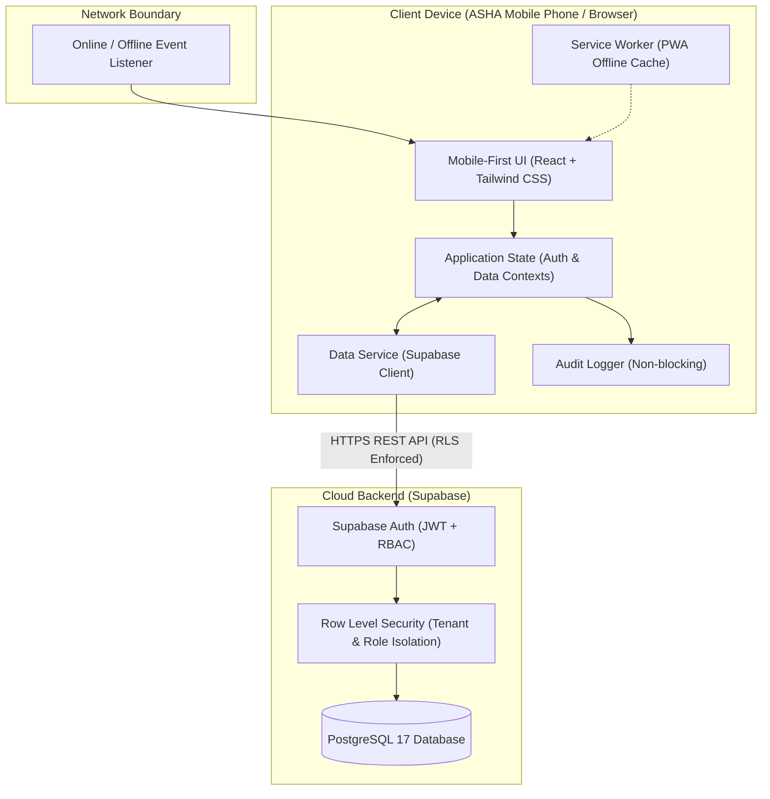
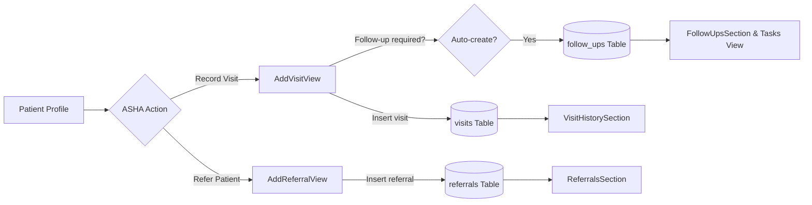

# ASHA Digital Platform — System Architecture

## 1. Executive Overview
The ASHA Digital Platform is an **offline-first Progressive Web Application (PWA)** engineered to replace manual registers for community health workers (ASHAs) across rural and semi-urban India. The system guarantees operational continuity under zero-connectivity conditions while maintaining strict role-based access, auditability, and data integrity with a central cloud backend.



## 2. Directory Structure Implemented (Phase 1)

```
.
├── .agents/
│   └── skills/                  # Domain, testing, and UI agent skills
├── docs/                        # Architecture, database, security, demo specifications
├── public/                      # Static assets & icons
├── src/
│   ├── components/
│   │   └── common/              # Accessible Button, Input, Card, Badge, Alert, Spinner
│   ├── constants/               # Demo credentials and static constants
│   ├── features/
│   │   ├── asha/                # ASHA field worker dashboard shell
│   │   ├── auth/                # Login screen with 1-tap demo personas
│   │   ├── manager/             # PHC Manager inventory console
│   │   └── supervisor/          # Supervisor sector oversight shell
│   ├── hooks/                   # useAuth hook and AuthProvider
│   ├── layouts/                 # AppLayout with persistent sync/offline indicator
│   ├── lib/                     # Supabase client initialization
│   ├── services/                # authService, dataService, auditLogger
│   ├── types/                   # TypeScript database entities & schemas
│   ├── utils/                   # Zod validation schemas
│   ├── App.tsx                  # Root role-based router
│   ├── index.css                # Tailwind directives & mobile touch tokens
│   ├── main.tsx                 # React DOM root entry
│   └── vite-env.d.ts            # Vite environment types
├── supabase/
│   ├── migrations/              # PostgreSQL DDL migrations
│   └── seed/                    # Demo catalog medicines and stock seed data
├── tests/                       # Playwright E2E test suites
├── package.json
├── playwright.config.ts
├── tailwind.config.js
├── tsconfig.json
└── vite.config.ts
```

## 3. Technology Evaluation & Decision Rationale

| Layer | Chosen Technology | Why it was Chosen | Rejected Alternatives |
|---|---|---|---|
| **Build & UI** | Vite + React + TypeScript | Ultra-fast build times, lightweight bundle, zero server-rendering overhead. | Next.js (SSR unnecessary for client-first mobile app; hydration conflicts when offline). |
| **Styling** | Tailwind CSS | Zero runtime overhead, 48px touch targets, accessible healthcare contrast tokens. | CSS Modules / Emotion (higher boilerplate, larger runtime). |
| **Backend & DB** | Supabase (PostgreSQL 17) | Declarative RLS, built-in Auth, automatic REST APIs, schema migrations via MCP. | Custom Express/NestJS (redundant boilerplate for hackathon timeline). |
| **Validation** | Zod | Runtime type safety, clear error messages for forms and API contracts. | Manual conditionals (prone to missing validation edge cases). |
| **Testing** | Playwright | Mobile device emulation (Pixel 7, iPhone SE), headless execution, cross-role auth tests. | Cypress (heavier setup, less granular viewport control). |

## 4. Phase 3 Workflow — Home Visits, Follow-ups & Referrals



- **Home Visits (`AddVisitView`)**: ASHA logs routine ANC, PNC, immunization, general checkup, or communicable disease checkups with vitals and clinical notes. If follow-up is checked, an auto-linked follow-up task is scheduled.
- **Follow-up Reminders (`FollowUpsSection` & `FollowUpsListView`)**: Tracks pending, completed, overdue, and upcoming field tasks with 1-tap "Mark Done" status reconciliation.
- **Referrals (`AddReferralView` & `ReferralsSection`)**: Direct referral to Sub-Centre, PHC, CHC, or District Hospital with clinical reason, transport details, and attendance tracking.

