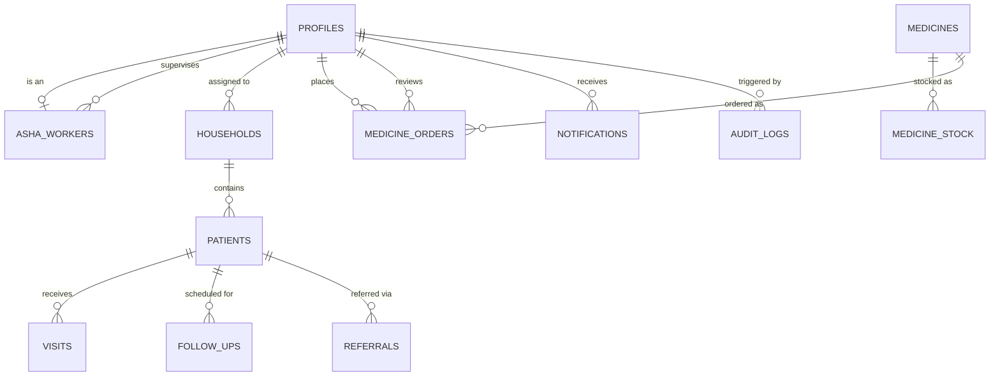

# ASHA Digital Platform — Database Design & Data Model

## 1. Entity-Relationship Overview

## 2. Phase 1 Implemented Tables

### Core Identity & Demographics

#### `profiles` (Mirrors `auth.users`)
- `id` (UUID, PK) -> references `auth.users(id) ON DELETE CASCADE`
- `full_name` (TEXT, NOT NULL)
- `phone` (TEXT)
- `role` (TEXT, CHECK: `'asha'`, `'supervisor'`, `'manager'`)
- `preferred_language` (TEXT, CHECK: `'en'`, `'hi'`, `'mr'`, `'cg'`)
- `is_active` (BOOLEAN, DEFAULT true)
- `created_at` (TIMESTAMPTZ, DEFAULT timezone('utc', now()))
- `updated_at` (TIMESTAMPTZ, DEFAULT timezone('utc', now()))

#### `asha_workers`
- `id` (UUID, PK, DEFAULT gen_random_uuid())
- `profile_id` (UUID, FK -> `profiles(id) ON DELETE RESTRICT`)
- `employee_id` (TEXT, UNIQUE)
- `assigned_supervisor_id` (UUID, FK -> `profiles(id) ON DELETE SET NULL`)
- `village` (TEXT, NOT NULL)
- `sub_centre` (TEXT)
- `phc_name` (TEXT)
- `is_active` (BOOLEAN, DEFAULT true)
- `created_at` (TIMESTAMPTZ)
- `updated_at` (TIMESTAMPTZ)

#### `households`
- `id` (UUID, PK, DEFAULT gen_random_uuid())
- `household_code` (TEXT, UNIQUE, NOT NULL)
- `head_of_family` (TEXT, NOT NULL)
- `address` (TEXT, NOT NULL)
- `village` (TEXT, NOT NULL)
- `ward` (TEXT)
- `assigned_asha_id` (UUID, FK -> `profiles(id) ON DELETE RESTRICT`)
- `created_at` (TIMESTAMPTZ)
- `updated_at` (TIMESTAMPTZ)

#### `patients`
- `id` (UUID, PK, DEFAULT gen_random_uuid())
- `household_id` (UUID, FK -> `households(id) ON DELETE RESTRICT`)
- `assigned_asha_id` (UUID, FK -> `profiles(id) ON DELETE RESTRICT`)
- `patient_code` (TEXT, UNIQUE, NOT NULL)
- `full_name` (TEXT, NOT NULL)
- `date_of_birth` (DATE)
- `gender` (TEXT, CHECK: `'female'`, `'male'`, `'other'`)
- `phone` (TEXT)
- `address` (TEXT)
- `relationship_to_head` (TEXT)
- `status` (TEXT, CHECK: `'active'`, `'migrated'`, `'deceased'`)
- `created_at` (TIMESTAMPTZ)
- `updated_at` (TIMESTAMPTZ)

---

### Field Clinical Workflow

#### `visits`
- `id` (UUID, PK, DEFAULT gen_random_uuid())
- `patient_id` (UUID, FK -> `patients(id) ON DELETE RESTRICT`)
- `asha_id` (UUID, FK -> `profiles(id) ON DELETE RESTRICT`)
- `visit_date` (DATE, NOT NULL, DEFAULT CURRENT_DATE)
- `visit_type` (TEXT, CHECK: `'routine_anc'`, `'pnc'`, `'immunization'`, `'general_checkup'`, `'communicable_disease'`)
- `notes` (TEXT)
- `follow_up_required` (BOOLEAN, DEFAULT false)
- `next_follow_up_date` (DATE)
- `created_at` (TIMESTAMPTZ)
- `updated_at` (TIMESTAMPTZ)

#### `follow_ups`
- `id` (UUID, PK, DEFAULT gen_random_uuid())
- `patient_id` (UUID, FK -> `patients(id) ON DELETE RESTRICT`)
- `assigned_asha_id` (UUID, FK -> `profiles(id) ON DELETE RESTRICT`)
- `due_date` (DATE, NOT NULL)
- `status` (TEXT, CHECK: `'pending'`, `'completed'`, `'missed'`, `'cancelled'`)
- `notes` (TEXT)
- `completed_at` (TIMESTAMPTZ)
- `created_at` (TIMESTAMPTZ)
- `updated_at` (TIMESTAMPTZ)

#### `referrals`
- `id` (UUID, PK, DEFAULT gen_random_uuid())
- `patient_id` (UUID, FK -> `patients(id) ON DELETE RESTRICT`)
- `asha_id` (UUID, FK -> `profiles(id) ON DELETE RESTRICT`)
- `referred_to` (TEXT, NOT NULL)
- `reason` (TEXT, NOT NULL)
- `referral_date` (DATE, NOT NULL, DEFAULT CURRENT_DATE)
- `status` (TEXT, CHECK: `'referred'`, `'visited'`, `'admitted'`, `'discharged'`, `'cancelled'`)
- `notes` (TEXT)
- `created_at` (TIMESTAMPTZ)
- `updated_at` (TIMESTAMPTZ)

---

### Drug Logistics & Requisitions

#### `medicines`
- `id` (UUID, PK, DEFAULT gen_random_uuid())
- `name` (TEXT, NOT NULL)
- `generic_name` (TEXT, NOT NULL)
- `unit` (TEXT, NOT NULL, DEFAULT 'tablets')
- `active` (BOOLEAN, NOT NULL, DEFAULT true)
- `created_at` (TIMESTAMPTZ)
- `updated_at` (TIMESTAMPTZ)

#### `medicine_stock`
- `id` (UUID, PK, DEFAULT gen_random_uuid())
- `medicine_id` (UUID, FK -> `medicines(id) ON DELETE CASCADE`)
- `location` (TEXT, NOT NULL)
- `quantity` (INTEGER, NOT NULL, DEFAULT 0, CHECK >= 0)
- `minimum_quantity` (INTEGER, NOT NULL, DEFAULT 10, CHECK >= 0)
- `updated_at` (TIMESTAMPTZ)

#### `medicine_orders`
- `id` (UUID, PK, DEFAULT gen_random_uuid())
- `asha_id` (UUID, FK -> `profiles(id) ON DELETE RESTRICT`)
- `medicine_id` (UUID, FK -> `medicines(id) ON DELETE RESTRICT`)
- `requested_quantity` (INTEGER, NOT NULL, CHECK > 0)
- `approved_quantity` (INTEGER, CHECK >= 0)
- `status` (TEXT, CHECK: `'pending'`, `'approved'`, `'rejected'`, `'fulfilled'`, `'cancelled'`)
- `requested_at` (TIMESTAMPTZ, NOT NULL)
- `reviewed_by` (UUID, FK -> `profiles(id) ON DELETE SET NULL`)
- `reviewed_at` (TIMESTAMPTZ)
- `rejection_reason` (TEXT)
- `created_at` (TIMESTAMPTZ)
- `updated_at` (TIMESTAMPTZ)

---

### Governance & Notifications

#### `notifications`
- `id` (UUID, PK, DEFAULT gen_random_uuid())
- `recipient_profile_id` (UUID, FK -> `profiles(id) ON DELETE CASCADE`)
- `title` (TEXT, NOT NULL)
- `message` (TEXT, NOT NULL)
- `type` (TEXT, CHECK: `'info'`, `'alert'`, `'approval'`, `'sync'`)
- `is_read` (BOOLEAN, DEFAULT false)
- `created_at` (TIMESTAMPTZ)

#### `audit_logs`
- `id` (UUID, PK, DEFAULT gen_random_uuid())
- `actor_profile_id` (UUID, FK -> `profiles(id) ON DELETE SET NULL`)
- `action` (TEXT, NOT NULL)
- `table_name` (TEXT, NOT NULL)
- `record_id` (UUID, NOT NULL)
- `metadata` (JSONB, DEFAULT '{}'::jsonb)
- `created_at` (TIMESTAMPTZ)
