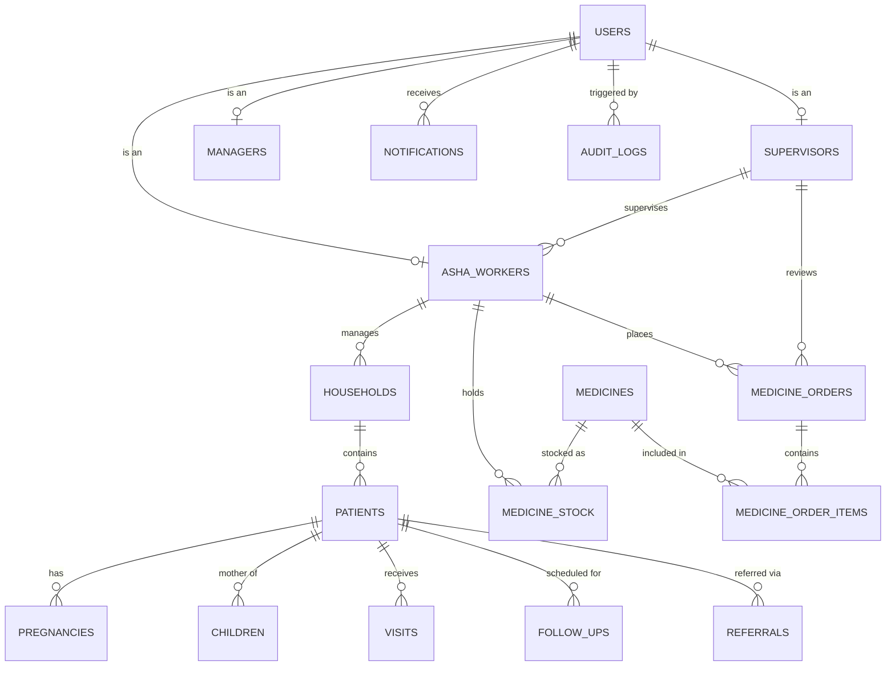

# ASHA Digital Platform — Database Design & Data Model

## 1. Entity-Relationship Overview

## 2. Table Specifications

### Core User & Profile Tables

#### `users` (Managed by Supabase Auth + Public Mirror)
- `id` (UUID, PK) -> references `auth.users.id`
- `email` (TEXT, UNIQUE, NOT NULL)
- `role` (user_role ENUM: `'asha_worker'`, `'supervisor'`, `'manager'`)
- `full_name` (TEXT, NOT NULL)
- `phone_number` (TEXT)
- `language_pref` (TEXT, DEFAULT `'hi'`)
- `created_at` (TIMESTAMPTZ, DEFAULT NOW())
- `updated_at` (TIMESTAMPTZ, DEFAULT NOW())

#### `asha_workers`
- `id` (UUID, PK) -> references `users.id`
- `supervisor_id` (UUID, FK -> `supervisors.id`, NULLABLE)
- `sub_centre_name` (TEXT, NOT NULL)
- `phc_name` (TEXT, NOT NULL)
- `assigned_village` (TEXT, NOT NULL)
- `ward_number` (TEXT)
- `created_at` (TIMESTAMPTZ, DEFAULT NOW())

#### `supervisors`
- `id` (UUID, PK) -> references `users.id`
- `phc_name` (TEXT, NOT NULL)
- `sector_name` (TEXT, NOT NULL)
- `created_at` (TIMESTAMPTZ, DEFAULT NOW())

#### `managers`
- `id` (UUID, PK) -> references `users.id`
- `phc_name` (TEXT, NOT NULL)
- `district` (TEXT, NOT NULL)
- `created_at` (TIMESTAMPTZ, DEFAULT NOW())

---

### Demographics & Household Tables

#### `households`
- `id` (UUID, PK)
- `assigned_asha_id` (UUID, FK -> `asha_workers.id`, NOT NULL)
- `household_number` (TEXT, NOT NULL)
- `head_of_family` (TEXT, NOT NULL)
- `village_hamlet` (TEXT, NOT NULL)
- `contact_phone` (TEXT)
- `ration_card_type` (TEXT: `'BPL'`, `'APL'`, `'Antyodaya'`)
- `sanitation_facility` (BOOLEAN, DEFAULT FALSE)
- `potable_water` (BOOLEAN, DEFAULT FALSE)
- `created_at` (TIMESTAMPTZ, DEFAULT NOW())
- `updated_at` (TIMESTAMPTZ, DEFAULT NOW())

#### `patients`
- `id` (UUID, PK)
- `household_id` (UUID, FK -> `households.id`, NOT NULL)
- `assigned_asha_id` (UUID, FK -> `asha_workers.id`, NOT NULL)
- `full_name` (TEXT, NOT NULL)
- `gender` (TEXT: `'female'`, `'male'`, `'other'`)
- `dob` (DATE)
- `age_years` (INTEGER)
- `abha_id` (TEXT)
- `marital_status` (TEXT)
- `phone_number` (TEXT)
- `is_pregnant` (BOOLEAN, DEFAULT FALSE)
- `is_infant` (BOOLEAN, DEFAULT FALSE)
- `has_chronic_illness` (BOOLEAN, DEFAULT FALSE)
- `created_at` (TIMESTAMPTZ, DEFAULT NOW())
- `updated_at` (TIMESTAMPTZ, DEFAULT NOW())

---

### Maternal & Child Tracking Tables

#### `pregnancies`
- `id` (UUID, PK)
- `patient_id` (UUID, FK -> `patients.id`, NOT NULL)
- `assigned_asha_id` (UUID, FK -> `asha_workers.id`, NOT NULL)
- `lmp_date` (DATE, NOT NULL)
- `edd_date` (DATE, NOT NULL)
- `gravida` (INTEGER, DEFAULT 1)
- `para` (INTEGER, DEFAULT 0)
- `anc_checkups_count` (INTEGER, DEFAULT 0)
- `is_high_risk` (BOOLEAN, DEFAULT FALSE)
- `high_risk_reasons` (TEXT[])
- `delivery_status` (TEXT: `'pregnant'`, `'delivered'`, `'miscarriage'`)
- `delivery_date` (DATE)
- `created_at` (TIMESTAMPTZ, DEFAULT NOW())
- `updated_at` (TIMESTAMPTZ, DEFAULT NOW())

#### `children`
- `id` (UUID, PK)
- `patient_id` (UUID, FK -> `patients.id`, NOT NULL)
- `mother_id` (UUID, FK -> `patients.id`, NULLABLE)
- `assigned_asha_id` (UUID, FK -> `asha_workers.id`, NOT NULL)
- `birth_weight_kg` (NUMERIC(4,2))
- `delivery_place` (TEXT: `'phc'`, `'chc'`, `'district_hospital'`, `'home'`)
- `immunization_status` (JSONB)
- `created_at` (TIMESTAMPTZ, DEFAULT NOW())
- `updated_at` (TIMESTAMPTZ, DEFAULT NOW())

---

### Clinical Visits, Follow-ups & Referrals

#### `visits`
- `id` (UUID, PK)
- `patient_id` (UUID, FK -> `patients.id`, NOT NULL)
- `assigned_asha_id` (UUID, FK -> `asha_workers.id`, NOT NULL)
- `visit_date` (DATE, NOT NULL)
- `visit_type` (TEXT: `'routine_anc'`, `'pnc'`, `'immunization'`, `'general_checkup'`)
- `symptoms_notes` (TEXT)
- `blood_pressure_systolic` (INTEGER)
- `blood_pressure_diastolic` (INTEGER)
- `weight_kg` (NUMERIC(5,2))
- `ifa_tablets_given` (INTEGER, DEFAULT 0)
- `created_at` (TIMESTAMPTZ, DEFAULT NOW())

#### `follow_ups`
- `id` (UUID, PK)
- `patient_id` (UUID, FK -> `patients.id`, NOT NULL)
- `assigned_asha_id` (UUID, FK -> `asha_workers.id`, NOT NULL)
- `due_date` (DATE, NOT NULL)
- `reason` (TEXT, NOT NULL)
- `priority` (TEXT: `'normal'`, `'high'`, `'urgent'`)
- `status` (TEXT: `'pending'`, `'completed'`, `'missed'`)
- `completed_at` (TIMESTAMPTZ)
- `created_at` (TIMESTAMPTZ, DEFAULT NOW())

#### `referrals`
- `id` (UUID, PK)
- `patient_id` (UUID, FK -> `patients.id`, NOT NULL)
- `assigned_asha_id` (UUID, FK -> `asha_workers.id`, NOT NULL)
- `referral_facility` (TEXT: `'Sub-Centre'`, `'PHC'`, `'CHC'`, `'District Hospital'`)
- `reason_for_referral` (TEXT, NOT NULL)
- `urgency` (TEXT: `'routine'`, `'urgent'`, `'critical'`)
- `transport_arranged` (BOOLEAN, DEFAULT FALSE)
- `status` (TEXT: `'referred'`, `'visited'`, `'admitted'`, `'discharged'`)
- `created_at` (TIMESTAMPTZ, DEFAULT NOW())

---

### Medicine Inventory & Order Workflow

#### `medicines`
- `id` (UUID, PK)
- `name` (TEXT, NOT NULL)
- `dosage_form` (TEXT: `'tablets'`, `'syrup'`, `'sachet'`, `'kit'`)
- `standard_kit_quantity` (INTEGER, NOT NULL)
- `reorder_threshold` (INTEGER, NOT NULL)
- `description` (TEXT)

#### `medicine_stock`
- `id` (UUID, PK)
- `asha_id` (UUID, FK -> `asha_workers.id`, NOT NULL)
- `medicine_id` (UUID, FK -> `medicines.id`, NOT NULL)
- `current_quantity` (INTEGER, NOT NULL, DEFAULT 0)
- `last_replenished_at` (TIMESTAMPTZ)
- `updated_at` (TIMESTAMPTZ, DEFAULT NOW())

#### `medicine_orders`
- `id` (UUID, PK)
- `asha_id` (UUID, FK -> `asha_workers.id`, NOT NULL)
- `supervisor_id` (UUID, FK -> `supervisors.id`, NULLABLE)
- `order_status` (TEXT: `'pending'`, `'approved'`, `'rejected'`, `'fulfilled'`, `'cancelled'`)
- `notes` (TEXT)
- `reviewed_at` (TIMESTAMPTZ)
- `created_at` (TIMESTAMPTZ, DEFAULT NOW())

#### `medicine_order_items`
- `id` (UUID, PK)
- `order_id` (UUID, FK -> `medicine_orders.id`, NOT NULL)
- `medicine_id` (UUID, FK -> `medicines.id`, NOT NULL)
- `quantity_requested` (INTEGER, NOT NULL)
- `quantity_approved` (INTEGER)

---

### Notifications & Audit Logging

#### `notifications`
- `id` (UUID, PK)
- `user_id` (UUID, FK -> `users.id`, NOT NULL)
- `title` (TEXT, NOT NULL)
- `message` (TEXT, NOT NULL)
- `type` (TEXT: `'approval'`, `'alert'`, `'sync'`, `'reminder'`)
- `is_read` (BOOLEAN, DEFAULT FALSE)
- `created_at` (TIMESTAMPTZ, DEFAULT NOW())

#### `audit_logs`
- `id` (UUID, PK)
- `actor_id` (UUID, FK -> `users.id`, NOT NULL)
- `action` (TEXT, NOT NULL)
- `entity_type` (TEXT, NOT NULL)
- `entity_id` (UUID, NOT NULL)
- `details` (JSONB)
- `created_at` (TIMESTAMPTZ, DEFAULT NOW())
