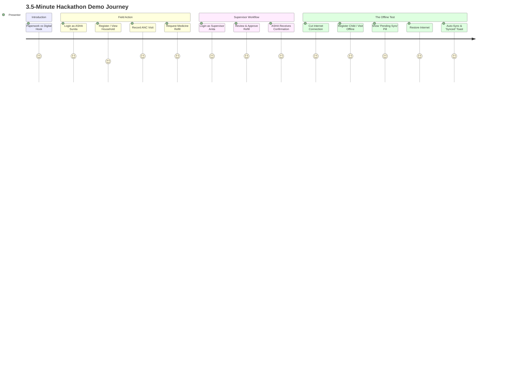

# ASHA Digital Platform — Hackathon Demo Script & Execution Guide

## Overview
- **Target Demo Duration**: 3 to 4 minutes.
- **Key Message**: Empowering grassroots health workers with an offline-first, mobile-optimized tool that eradicates lost paperwork, streamlines maternal-child tracking, and ensures reliable supply chain replenishment.

---

## 1. Setup Before the Pitch
1. Open the application on a mobile viewport (e.g. Chrome DevTools responsive mode set to iPhone SE / Pixel 7, or on a physical phone on the same local network).
2. Ensure realistic demo seed data is pre-populated:
   - ASHA persona: `asha.sunita@phc.in`
   - Supervisor persona: `supervisor.anita@phc.in`
   - Manager persona: `manager.rajesh@phc.in`

---

## 2. Minute-by-Minute Script

### Minute 0:00 - 0:45 — The Hook & Problem Statement
- **Spoken**: *"Over 1 million ASHA workers across India carry the burden of community healthcare on heavy paper registers. Vital maternal checkups get delayed, medicine kits run empty, and rural connectivity is spotty at best. Today, we present an offline-first digital companion purpose-built for their reality."*
- **Action**: Show language toggle switching seamlessly between English and Hindi (`हिन्दी`).

### Minute 0:45 - 1:45 — Field Operations (ASHA Experience)
- **Spoken**: *"Sunita, an ASHA in Ward 4, opens her daily agenda. Within one tap, she sees today's scheduled home visits."*
- **Action**:
  1. Click 1-tap demo login as **Sunita Devi (ASHA)**.
  2. Open pregnant mother **Pooja Sharma** (Trimester 2).
  3. Tap **Record ANC Visit**: enter BP (120/80), IFA tablets given (30), and tap Save.
  4. Navigate to **Medicine Kit**: Notice ORS packets low (4 left). Tap **Request Refill** for 20 packets. Status shows `Pending Supervisor Review`.

### Minute 1:45 - 2:30 — Supervisor Governance
- **Spoken**: *"Back at the Primary Health Centre, Supervisor Dr. Anita reviews community requisitions."*
- **Action**:
  1. Switch to **Supervisor Anita** via top demo role switcher.
  2. The requisition from Sunita appears at the top of the queue.
  3. Tap **Approve Order**.
  4. Switch back to Sunita: Instant notification badge indicates: *"Requisition #104 Approved"*.

### Minute 2:30 - 3:30 — The Clincher: Zero-Connectivity Field Test
- **Spoken**: *"Now Sunita walks into a remote tribal hamlet with zero cellular network. Watch what happens."*
- **Action**:
  1. Toggle DevTools Network to **Offline** (or toggle simulated offline switch in app).
  2. The top bar updates instantly to **🔴 Offline Mode — Local Persistence Active**.
  3. Register an immunization visit for infant **Aarav** (6 weeks, OPV-1 + Pentavalent-1 administered).
  4. Tap **Save Visit**. The visit saves immediately without freezing!
  5. Top indicator shows: **🟡 Pending Sync (1)**.
  6. Reconnect network: Switch back to **Online**.
  7. The sync engine triggers automatically: status pulses to **Syncing...** then turns to **🟢 Synced**.
  8. Verify the record is saved to the central database without any duplication.

### Minute 3:30 - 4:00 — Conclusion & Impact
- **Spoken**: *"Zero lost records. Zero duplicate entries. Built with pure mobile-first ergonomics, bulletproof Row Level Security, and resilient offline synchronization. Thank you!"*
