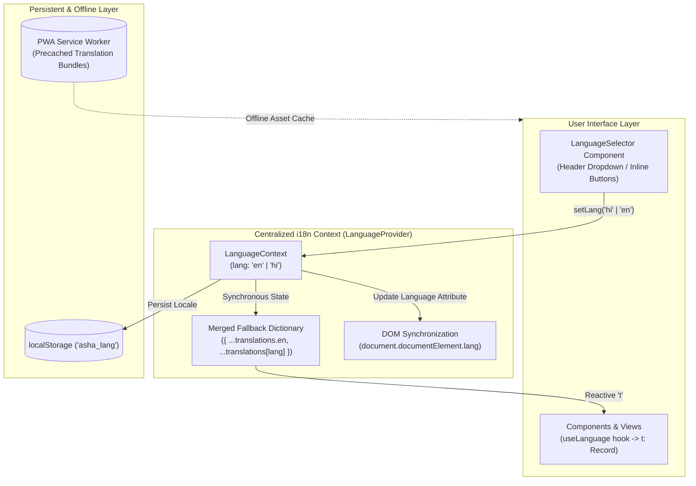

# ASHA Saathi (आशा साथी) — Internationalization (i18n) & Bilingual Architecture

> **Language & Localization Technical Specification**  
> **Supported Locales**: English (`en`) • Hindi (`hi` / `हिन्दी`)  
> **Architecture**: Client-side Reactive Context + Workbox Precache + Zero-Network Offline Switching

---

## 1. System Architecture

ASHA Saathi features a centralized, zero-latency reactive translation engine designed for frontline health workers in multilingual and low-connectivity environments.



---

## 2. Core Architectural Principles

### 2.1 Single Source of Truth
- **Provider**: `LanguageProvider` wraps the root application at `src/main.tsx`.
- **State**: The active language is managed solely via `LanguageContext` (`lang: 'en' | 'hi'`).
- **Zero Component Duplication**: No individual component maintains local or disconnected language state.

### 2.2 Safe Fallback Strategy (No Broken UI)
- To prevent missing keys from breaking the UI or displaying raw translation keys (such as `dashboard.todayVisits`), `useLanguage` computes a merged dictionary:
  ```typescript
  const t = useMemo(() => {
    const currentDict = translations[lang] || translations.en;
    const fallbackDict = translations.en;

    return {
      ...fallbackDict,
      ...currentDict,
    } as Record<TranslationKey, string>;
  }, [lang]);
  ```
- **Fallback Rule**: If any key is missing or undefined in Hindi (`hi`), it automatically resolves to its English (`en`) equivalent with zero console crashes or blank screens.

### 2.3 Offline-First Localization
- All translation dictionaries are bundled directly into the static client JavaScript bundle (`src/locales/translations.ts`).
- **Zero Network Calls**: Switching between English and Hindi requires **0 bytes of network traffic**.
- **Full Offline Operability**: ASHA workers can freely toggle languages in remote villages with zero cellular reception.

### 2.4 Persistence Across Sessions & Navigation
- The selected locale is written to `localStorage.getItem('asha_lang')`.
- Upon browser refresh, tab reopening, or navigation across patient records, households, and visits, the application re-hydrates the saved locale.
- `document.documentElement.lang` is dynamically synchronized (`en` or `hi`) for proper screen reader and assistive technology pronunciation.

---

## 3. UI Language Selector (`LanguageSelector.tsx`)

The application provides an accessible, mobile-first language selector component:
- **Location**:
  1. Top-right navigation bar in `AppLayout.tsx` across all authenticated views (ASHA, Supervisor, Manager).
  2. Top-right corner of the unauthenticated `LoginView.tsx` screen.
  3. Interactive inline buttons in the ASHA Profile settings view (`AshaProfileView.tsx`).
- **Accessibility & Touch**:
  - Minimum **48px touch targets** for easy thumb operation on budget smartphones.
  - Native language names displayed: `English` and `हिन्दी`.
  - ARIA attributes: `aria-haspopup="listbox"`, `aria-expanded`, `role="listbox"`, and `role="option"`.
  - Full keyboard accessibility: Closes on `Escape` key, selects on Enter/Space, closes on outside click.

---

## 4. Key Parity & Translation Coverage

The application maintains strict 1:1 key parity between English and Hindi dictionaries in [`src/locales/translations.ts`](file:///Users/khemrajsahu/Downloads/IUR%2026%20/src/locales/translations.ts):

| Domain | Keys Covered | English Example | Hindi Example |
|---|:---:|---|---|
| **Brand & Navigation** | 16 | `ASHA Field Dashboard` | `आशा कार्यक्षेत्र डैशबोर्ड` |
| **Households & Family** | 19 | `Add Household` | `नया परिवार जोड़ें` |
| **Patients & Demographics** | 27 | `Patient Profile` | `मरीज प्रोफाइल` |
| **Maternal & Pregnancy** | 25 | `Expected Due Date (EDD)` | `संभावित प्रसव तिथि (EDD)` |
| **Child Tracking & Growth** | 12 | `Child Growth & Vaccines` | `शिशु स्वास्थ्य व टीकाकरण` |
| **Tasks & Agenda** | 12 | `Today's Tasks` | `आज के कार्य` |
| **Notifications** | 6 | `Notifications` | `सूचनाएं एवं अलर्ट` |
| **Logistics & Medicines** | 14 | `Drug Kit` | `दवा किट` |
| **Reports & Analytics** | 8 | `My Work Report` | `मेरी कार्य रिपोर्ट` |
| **Supervisor & Manager** | 14 | `Activity & Monitoring` | `गतिविधि एवं निगरानी` |
| **Login & Auth** | 7 | `Standard Login` | `मानक लॉगिन` |

---

## 5. Adding a New Regional Language (e.g. Marathi / Chhattisgarhi)

To extend ASHA Saathi to another Indian regional language:
1. In `src/locales/translations.ts`:
   - Update `export type Language = 'hi' | 'en' | 'mr';`
   - Add the new language dictionary:
     ```typescript
     export const translations = {
       en: { ... },
       hi: { ... },
       mr: {
         appName: 'आशा साथी',
         ...
       }
     };
     ```
2. In `src/components/common/LanguageSelector.tsx`:
   - Add `{ code: 'mr', label: 'Marathi', nativeLabel: 'मराठी' }` to the `languages` array.
3. Test key parity using the validation check:
   ```bash
   node -e "
     const { translations } = require('./src/locales/translations.ts');
     // Compare Object.keys(translations.en) with Object.keys(translations.mr)
   "
   ```

---

## 6. Automated Playwright Verification

The translation subsystem is verified by automated E2E tests in [`tests/language_switcher.spec.ts`](file:///Users/khemrajsahu/Downloads/IUR%2026%20/tests/language_switcher.spec.ts):
- `should display language selector on login screen and switch between English and Hindi`
- `should switch language for ASHA worker and update dashboard and bottom navigation`
- `should persist selected language across page navigation and refresh`
- `should support language switching for Supervisor role`
- `should support language switching for Manager role`
- `should switch and retain language when offline`
