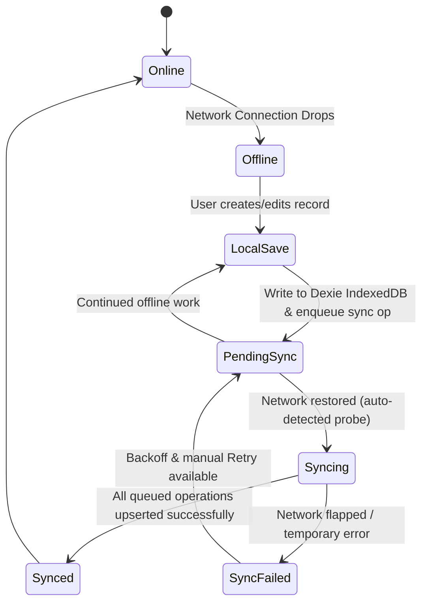

# ASHA Digital Platform — Offline-First Architecture & Sync Engine

## 1. Overview & Operational Reality in Rural Fieldwork
ASHA workers frequently operate in remote tribal settlements, rural forest belts, and interior hamlets with zero mobile data connectivity. The system architecture is designed from the foundation so that offline operation is the standard baseline rather than an exceptional error state.



---

## 2. Client-Side Persistence Architecture (Dexie.js / IndexedDB)
- **Local Database Name**: `AshaSaathiDB`
- **Stores & Indexes**:
  - `profiles`: `&id, user_id, sync_status`
  - `households`: `&id, assigned_asha_id, sync_status, household_code`
  - `patients`: `&id, household_id, assigned_asha_id, sync_status, patient_code, full_name`
  - `visits`: `&id, patient_id, asha_id, sync_status, visit_date`
  - `follow_ups`: `&id, patient_id, assigned_asha_id, sync_status, status, due_date`
  - `referrals`: `&id, patient_id, asha_id, sync_status`
  - `medicines`: `&id, name, sync_status`
  - `medicine_stock`: `&id, medicine_id, sync_status`
  - `medicine_orders`: `&id, asha_id, medicine_id, sync_status`
  - `notifications`: `&id, user_id, sync_status, read`
  - `pregnancies`: `&id, patient_id, status, sync_status`
  - `sync_queue`: `&id, entity_type, entity_id, sync_status, created_at, depends_on_entity_id`
  - `sync_metadata`: `&key`

---

## 3. The Sync Operation Queue
Whenever an ASHA records or edits data:
1. A client UUID (`crypto.randomUUID()`) is assigned as the immutable primary key.
2. The record is written to IndexedDB immediately with `sync_status = 'pending'`.
3. An operation is enqueued into `sync_queue`:
   ```typescript
   export interface SyncOperation {
     id: string; // unique operation UUID
     entity_type: string; // 'households' | 'patients' | 'visits' | ...
     entity_id: string; // client UUID of entity
     operation_type: 'CREATE' | 'UPDATE' | 'DELETE';
     payload: Record<string, unknown>;
     created_at: string;
     retry_count: number;
     last_attempted_at: string | null;
     sync_status: 'pending' | 'syncing' | 'synced' | 'failed';
     error_message: string | null;
     depends_on_entity_id: string | null;
   }
   ```
4. If online, `syncManager.sync()` initiates immediately. If offline, the queue persists securely in IndexedDB across app relaunches and device reboots.

---

## 4. Idempotency & Relational Dependency Order
- **Idempotency Strategy**: Cloud Supabase operations use `upsert` with `onConflict: 'id'`. If an operation is transmitted multiple times due to a dropped TCP connection during acknowledgment, the second write updates the existing ID without generating duplicate rows.
- **Relational Dependency Order**:
  1. `households` (Root parent)
  2. `patients` (Depends on household)
  3. `pregnancies` (Depends on patient)
  4. `visits` / `follow_ups` / `referrals` (Depends on patient)
  5. `medicine_orders` (Scoped to ASHA)

---

## 5. Network Connectivity Detection
- Does not rely solely on `navigator.onLine` (which can report false positives on captive portals/dead Wi-Fi).
- Uses `connectivityService` with lightweight `HEAD` probes to the Supabase REST health endpoint with a 5000ms timeout.
- Debounced events prevent flapping when crossing weak cellular boundary zones.

---

## 6. Sync Indicator & Status Bar
The top `SyncStatusBar` component provides immediate feedback:
- 🟢 **Online / All changes synced** (Idle, connected)
- 🔴 **Offline — changes saved on this device** (Network off, safe to work)
- 🟡 **N changes waiting to sync** (With "Sync Now" button)
- 🔵 **Syncing N changes...** (Active upload pulse animation)
- ⚠️ **N changes could not sync** (With "Retry" button)

---

## 7. Security & Logout Purge
- Sensitive field data cached in IndexedDB is scoped strictly to the authenticated ASHA.
- Upon calling `signOut()`, `clearLocalDatabase()` clears all tables in `AshaSaathiDB` to prevent cross-account data leakage on shared tablet hardware.
