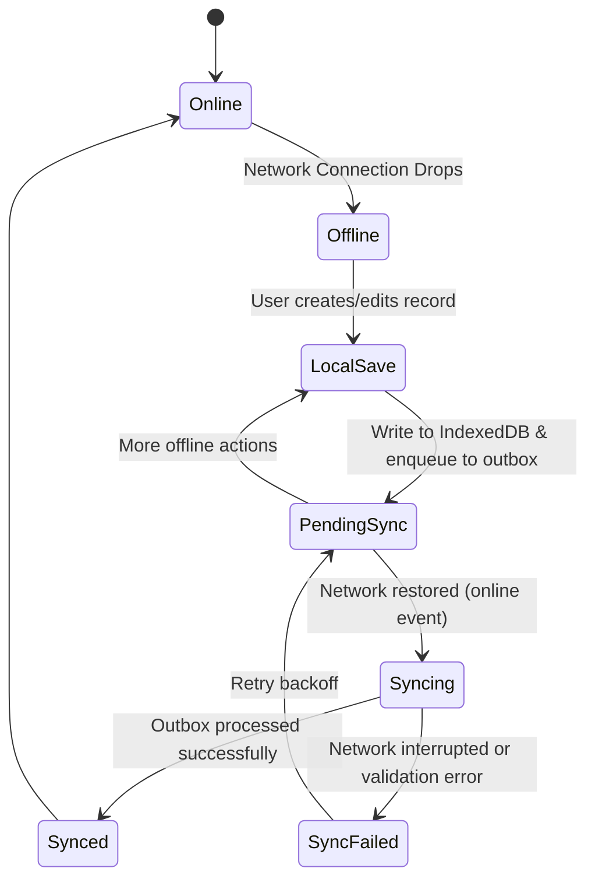

# ASHA Digital Platform — Offline-First Architecture & Sync Engine

## 1. The Offline Reality in Rural Health
ASHA workers frequently operate in remote villages and interior hamlets with zero mobile data connectivity. The system treats offline operation as the standard baseline, not an error exception.



## 2. Client-Side Persistence Architecture (Dexie.js / IndexedDB)
- **Local Database**: `asha_offline_db`
- **Stores**:
  - `households` (indexed by `id, assigned_asha_id, village_hamlet, sync_status`)
  - `patients` (indexed by `id, household_id, assigned_asha_id, full_name, sync_status`)
  - `pregnancies` (indexed by `id, patient_id, sync_status`)
  - `children` (indexed by `id, patient_id, mother_id, sync_status`)
  - `visits` (indexed by `id, patient_id, visit_date, sync_status`)
  - `follow_ups` (indexed by `id, patient_id, due_date, status, sync_status`)
  - `referrals` (indexed by `id, patient_id, status, sync_status`)
  - `medicine_stock` (indexed by `id, medicine_id, asha_id`)
  - `medicine_orders` (indexed by `id, asha_id, order_status, sync_status`)
  - `sync_queue` (indexed by `id, timestamp, status, retry_count`)

## 3. The Sync Outbox Pattern
Whenever a mutation occurs:
1. A unique client UUID (`crypto.randomUUID()`) is assigned as the primary key.
2. The record is stored in IndexedDB with `sync_status = 'pending'`.
3. An entry is enqueued into `sync_queue`:
   ```typescript
   interface SyncQueueItem {
     id: string; // queue item UUID
     entity_type: 'households' | 'patients' | 'visits' | 'follow_ups' | 'medicine_orders';
     entity_id: string; // primary key of record
     operation: 'INSERT' | 'UPDATE' | 'DELETE';
     payload: Record<string, unknown>;
     timestamp: number;
     status: 'pending' | 'syncing' | 'failed';
     retry_count: number;
     error_message?: string;
   }
   ```
4. If `navigator.onLine` is true, the `SyncEngine` initiates immediately. If offline, the queue awaits the `online` event or manual sync button.

## 4. Idempotency & Conflict Prevention
- **Idempotent Upserts**: The cloud database enforces UUID primary keys provided by the client. Using Supabase's `upsert` with `onConflict: 'id'`, replaying queued items is guaranteed to be safe and prevents duplicate rows.
- **Dependency Ordering**: Queue items are drained in strict foreign-key order:
  1. Households
  2. Patients
  3. Pregnancies / Children
  4. Visits / Follow-ups / Referrals
  5. Medicine Orders
- **Conflict Handling**: Last-Write-Wins (LWW) with client timestamp validation. Since each ASHA only mutates records in her assigned village, cross-user write collisions on the same patient are virtually non-existent in field practice.

## 5. Visual Sync States
The app header displays an unambiguous, real-time status indicator:
- 🟢 **Online & Synced** (Connected, 0 pending items)
- 🟡 **Pending Sync (3)** (Offline or waiting to flush outbox)
- 🔵 **Syncing Changes...** (Outbox active flush)
- 🔴 **Sync Alert / Retry** (Interrupted sync with tap-to-retry)
